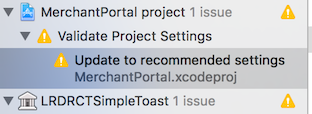

Before you build the app, follow the steps in described in [1-Build-Processs](https://github.com/coretech/pos-merchant-mobile/wiki/1-Build-Processs)

**Note:** To enable or disable dev mode, use the following command:

``react-native bundle --platform ios --dev true/false  --entry-file index.ios.js --bundle-output iOS/main.jsbundle``

**To Build an iOS App**

1. Use the following command to build and run the app: ``react-native run-ios``
   
    **Note:** The initial build will fail

    

1. In Finder, launch xCode by double clicking: 

    ``pos-merchant-mobile/ios/MerchantPortal.xcodeproj``

    
 
1. In xCode, change the **Bundle identifier** to com.nrs.app.merchantportal.

1. Locate Targets MerchanPortal and MerchanPortalTest and use the Team list to set the signing team

   
  
   

1. From the Product menu, choose **Build**.

   **Note:** The build will fail

1. In the Project Navigator, open **Update to recommended settings**:

    

1. In the Dialog, click **Perform Changes**:

      

1. From MerchantPortal, locate Linked Frameworks and Libraries and remove the -lRNSearchBar and -lArt libraries.

   

1. From the Product menu, choose **Build**.

1. Run the app:

   * **Emulator:**  At the command line, type: ``react-native run-ios``

   * **Device:** In xCode, press the **Play button:**
