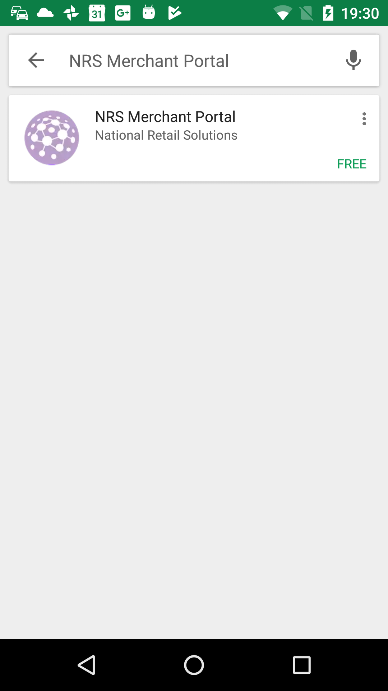
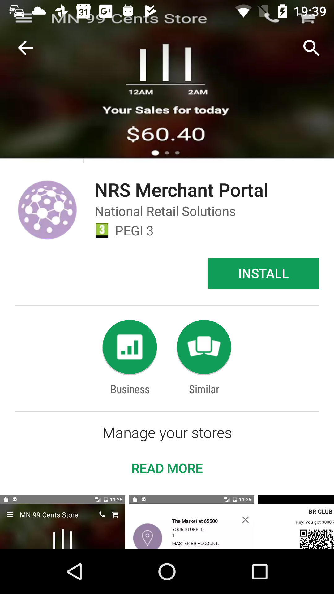
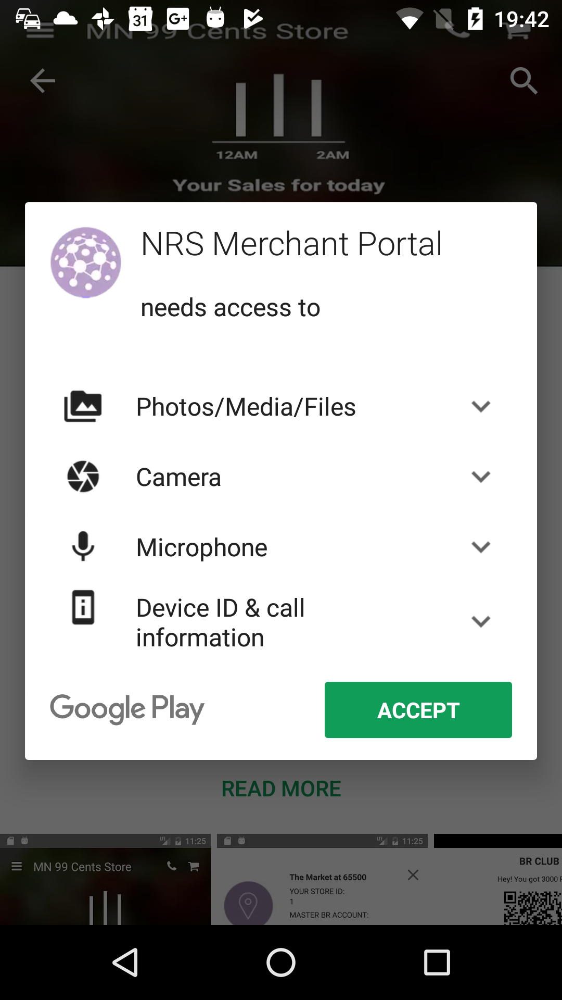
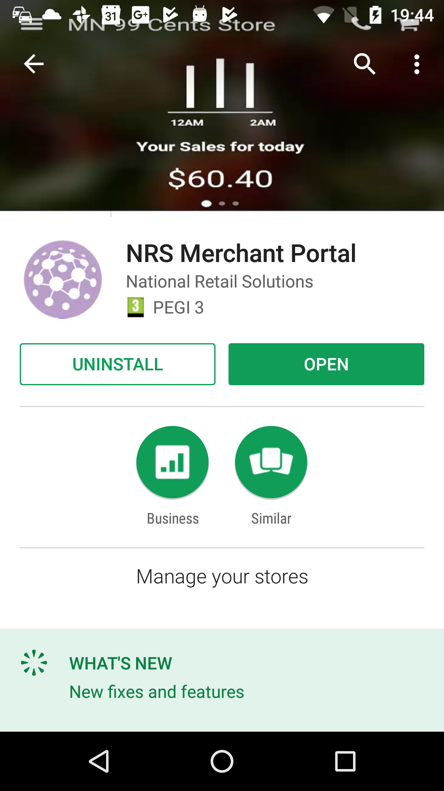
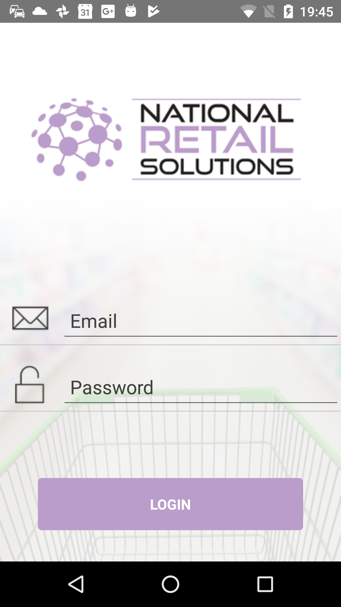

Beta testers can test app builds on their Android devices with the Google Play App.

## Enrolling in the Testing Program
This section describes how to sign

**To test an app on Android Devices with Google Play**
1. From a browser, open:  <https://play.google.com/apps/testing/[redacted]>

1. In the NRS Merchant Protal Page, click **Become a Tester**.

    

1. In the updated page, click **Download the NRS Merchant Portal app on Google Play**.

    

1. In the Login page, enter the credentials for the account.

    

1. In the NRS Merchant Portal dialog, click **Ok**.

    

   After the app installs, the NRS Merchant Portal Google Play page opens.

       

## Downloading via Google Play
Once you have enrolled in the testing program, you can install and update the app via Google Play on your device.

**To install via Google Play**.

1. On your Android device, launch the Google Play app.

1. In the App, search for **NRS Merchant Portal**.

    

1. In the App Page, click **Install**.

    

1. In the dialog, click **Accept**.
   
    

1. After the app is installed, click **Open**.

   

1. Log into the app.   

      
 

   
     
 

